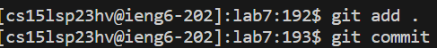
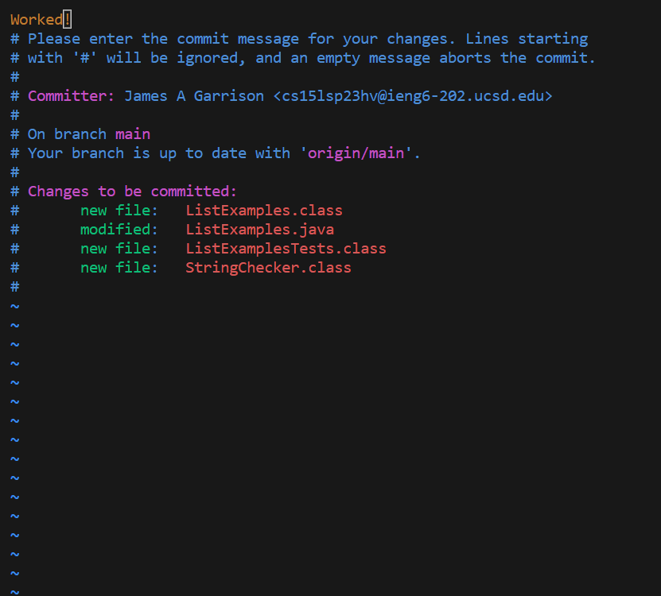
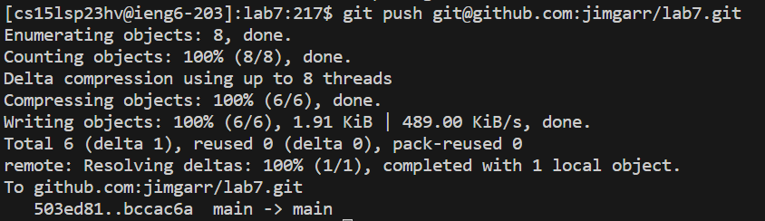
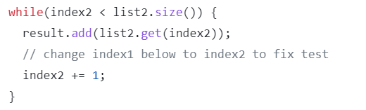

# Lab Report 4
This Lab Report practices using shortcuts and commands to speed up the process that was done in the lab. This process includes logging into the remote server, cloning the repository, running the tests which should fail, fixing the error, run the tests which should pass, and then committing and pushing the changes. 

## Log Into ieng6
The image below shows me logging in to my ieng6 account. The only commands I used were `<up><enter>`. Since the last command I had done on my computer (not on the remote server) was to log into my ieng6 account, I simply had to press the up arrow key which filled in the last command I had used. Since this was the command I needed, I pressed enter to execute the command. And as shown in the image, the command worked. 

## Cloning Fork of the Repository
The image below shows the command I used to clone the fork of the lab7 repository. 

Instead of having to type out the entire command and URL, I used the command history to fill in the command for me. To do this, I used the sequence `<CTRL-R>git c<enter>`. `<CTRL-R>` opens the command history so I all I have to do is type the beginning of the command and it autocompletes the correlating command. However, I used multiple git commands so typing in only `git` produced `git add .` which is a command I use later. So once I typed out `git cl` the only matching command was the git clone URL command as seen in the image below.

## Run Tests, Should Fail
The image below shows the commands I used to run the tests. Before I'm able to execute the command to run the tests, I first have to be in the correct directory. I start in the home directory which contains lab7 among other files/directories. So to change the directory, I use `cd l<tab><enter>`. cd changes the directory and I want to change it to lab7. So I start typing l and then I press `<tab>` which autofills the command since the only directory that begins with an l is lab7. Then I use `<enter>` to execute the command. I use a similar method for the command to run the tests. I used `bash t<tab><enter>` to run `bash test.sh`. I again used `<tab>` to autocomplete the command. 

## Fix Error
The image below is the command used to edit the error in the ListExamples.java file. I used `vim List<tab><enter>`, using the `<tab>` to autocomplete the command. 

Once in vim, I need to change index1 to index2 which can be located by the comment line stating where the error is. Since the line of code is decently far down in the code, I didn't want to have to keep pressing the down arrow key some 30+ times. I instead used the command `/` which locates the first instance of the word that is put after the /. Since there are multiple instances of index1, I then use `n` which goes to the next instance of index1. I keep pressing `n` until I get to the index1 I want to change. From here, I use `<right>` until the cursor is hovering over the 1. I then use `x` to delete it and use `i` to enter insert mode. I then insert 2 and press `<esc>` to exit insert mode. I want to save these changes so I then use `:wq<enter>` to exit and save. Overall, the sequence of commands looks like `/index1<enter>nnnnnnnnn<right><right><right><right><right>xi2<esc>:wq<enter>`. The image below is the vim editor page where the commands were used.

## Run Tests, Should Pass
Same as before, I used `bash t<tab><enter>` to run the tests. Again, I used `<tab>` to autocomplete the command. This time, the tests pass, meaning I successfully fixed the error.

## Commit and Push
Now I need to add the changes, commit them, and finally publish them by pushing them to the main branch. The image below includes the commands I used to add and commit the changes. To add, I used `git add .<enter>` which adds the changes that I made so they can be committed. The `.` after `git add` is referencing the current directory. Then I use `git commit<enter>` to commit the changes.

Once I execute the commit command, a new page opens in the terminal as shown in the image below. This page gives information about the changes that I'm committing. The page asks you to give a commit message and to do so, you have to use vim commands. I want to use the message "Worked!" that again is shown in the image below. To do so, I press `i` to enter insert mode. I then type the message `Worked!` and `<esc>` to leave insert mode. Finally, I use `:wq<enter>` to save and exit the page. The full list of commands is `iWorked!<esc>:wq<enter>`.

Now to push you have to use the `git push` command. However, you also need to add the location of where to push which is specific to each person's GitHub account. So the entire command should look something like `git push (personal URL/SSH)<enter>`. My command is shown in the image below as well as the confirmation message that the push worked. 

Now when I go to my GitHub account and open the ListExamples.java file the change I made is there!

